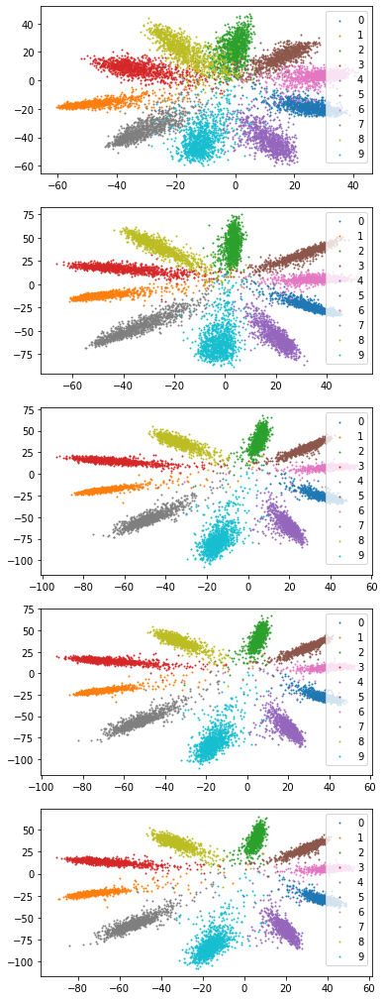
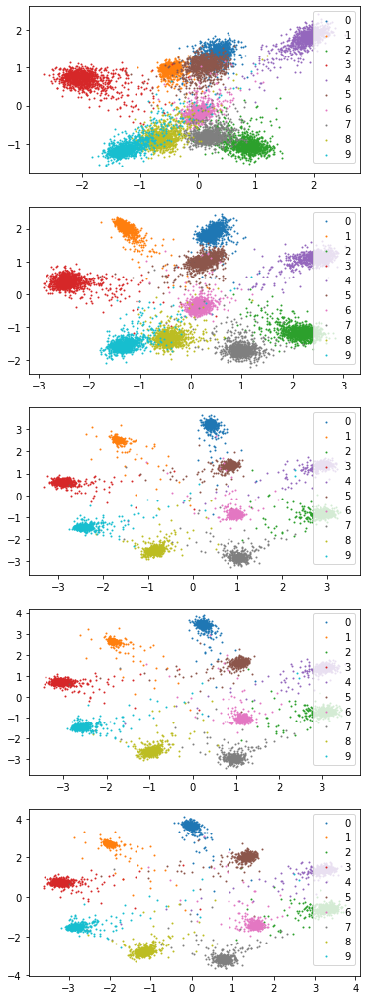

# Metric Learning Playground

Depends on `mmcls`.

What I want to reproduce:
- [x] center loss
- [x] ArcFace
- [x] CosFace
- [x] SphereFace
- [x] CircleLoss

# Center Loss

## Results

  
  

# SphereFace

- Not reproduced completely. Feature embedding seems buggy

## Results

  

# ArcFace, CosFace

__NOTES__:
- Embedding feature space must be more than 3 (doesn't train well with `vis_dim=2`).
- `CosFace` is not that robust and needs good hyperparameters
- The embedded features for `arcface` does not seem like it is well reproduced.

## Results

  
  

# CircleLoss

## Results

  

